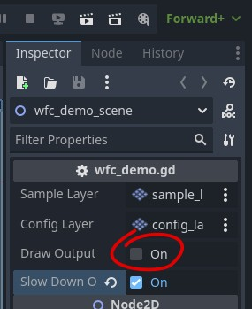
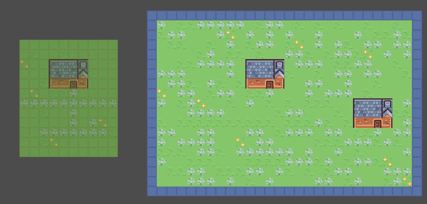

# Wave Function Collapse Lab 1

Hi, welcome to the lab 1. Let's embark on a yourney to explore the wave function collapse algorithm.

To get started just open up the project in Godot (4.3 at the time of writing) and open the wfc_demo scene.

You get two layers of tile maps to play with now.

- The sample layer is like a canvas to draw two things: The template which defines which tiles can be next to a tile and the seed tiles to use when generating the output.
- The config layer is used to define which area of the sample layer is supposed to be the template and which area is to be used for the output.

Together they make up the input for the algorithm. One quirk of the implementation here is that the config and sample areas are ignoring a one tile wide outer border. This means the minimum area you want to define is 3 by 3.

> *You may wan't to make sure not to move the layers around, they should keep aligned or you will lose track of what tile in the config layer corresponds to which tile in the sample layer.*

Let's generate our first output. There is a bool variable export you can see when you select the root node of the scene. It's kind of a quick hack button to trigger the generation of the output.

In fact the algorithm is implemented as a tool script. If you don't know tool scripts, they differ from the normal scripts in that they can execute while the editor runs and not just during the game.

The button is made to click. Go ahead. Click it. If you left the sample and config layer untouched, you should get an output that is similar to this:

Each time you trigger the generation a new tile map layer called output is generated. Godot will increment a number behind the name automatically to make them unique. You may notice that the generations are quite similar. Later on we will fix this up a bit. By the way, if you want a fancy animation you can click "slow down output" to toggle this export variable below the "draw output" boolean. This just adds a tiny delay after each new tile is revealed.

So did you see the the field is random and the two houses remain the same? And there is always a stone path below the doors and the flowers only ever appear next to a stone path. This is are due to how the sample layer is set. Let's look at what it does.

The sample layer has a small drawing of a house and a stone path and surrounding field. In the configuration layer this is all defined as template area. The outer 1 tile wide border is recognized as possible adjacent tiles, but those tiles are never chosen in the output. This is not necessary to be so for the algorithm, just an implementation detail here. By the way you can toggle the visibility of the configuration layer to better see the sample layer.

This template area defines which tiles are possible to exist next to each other. In the code it's called adjacencies.

- In the default sample the flowers are only ever next to the stone path inside the area. The tile on the border is not chosen ever.
- The house only consists of unique tiles so they can only ever exist next to each other.
- In the template the stone path is humanly recognizable as a path. Due to the fact that this implementation of the wfc algorithm only looks at direct adjacencies in a generated output this order is not preserved. There are different ways to achive an ordered path, we look at this later.

Now let's change the template a little bit.

Make sure to select the sample layer and the TileMap tab at the bottom. If you select the 3x3 sand tiles like in the screenshot, you can place them down and create a shape such as this:

Use the remaining sand tiles to fix up the inner corners and the middle sand tile to clean the borders. Then surround the rest with green tiles. It should look like this:

Select the config layer and draw over the full new template with the green tile. This sets this part of the sample up to also be used as part of the input template.

You will mostly get small patches of sand and sometime a bigger splotch. First of all we only have the sand pieces adjacent to pure green grass tiles, so we never get it as neighbors for stone path or flowers. With a little more painter work we may get a more interesting path system, especially if we increase the output area.

However we already find a limitation of this implementation here. Only looking at direct adjacencies doesn't preserve context very well. One way to amend this would be to look at larger patterns. Like 2x2 or 3x3. That's a more advanced topic, addressed in lab 2.

##

Meanwhile you might be wondering why only two houses get generated with the original template. Exactly two houses always show up. Never more, never less.

Select the sample layer, then select the TileSet tab at the bottom. Click at the paint button next to the tile preview and select custom layer weight. You will see this:

The house tiles have a zero assigned to it, all other tiles are marked with a 1. The implementation in the wfc demo uses a very binary definition of a weighted choice of tiles. Basically if the custom layer with the name weight exists, those values will be read into a lookup table and if the weight is zero the corresponding tile will never be chosen at random to fill the output. However if such a tile is used as a seed value in the output part of the definition the tiles can still be generated if they are the only possible choice to make. Neat, right? You just place down a door and get the rest of the house for free. Actually, why don't you just try and delete the custom layer. See, now you get a lot of houses if you generate a new output. This will probably crash the housing market, so maybe it's better to undo the delete.

Also, do try to set two doors in the sample layer very close together. This will break the generation. If the rules get too complicated for the generator so solve all the remaining tiles will be set to a value that's very unlikely in a sensible tile set. If this happens often you may want to change the template to allow for more possible variants of tile adjacencies, or look at the seed tiles if they cause a difficult to solve situation.

If we chose the algorithm for an automated level generator there are ways to make it more robust. One might implement backtracking to backtrack on the random choices and try a different value. Actually that's how a basic sodoku solver would work. Or just start over completely if the generation fails. That might be acceptable if you only sometimes fails. This, too, is beyond the scope of this lab.

## How does Wave Function Collapse work?

So we've looked quite a lot at what different input does to the possible output. And you know what, that's exactly the extend of this lab. Here at the end you just get a very brief explanation of the algorithm, barely enough to implement it on your own. You can look at the script to get the implementation details or move on to the other labs. In lab 2 you get to write a bit of code to enhance the features and in lab 3 you get a more detailed explanation of the algorithm to challenge yourself to write your own implementation.

Here is the short version of the explanation:
The algorithm needs a definition of which tiles can exist next to each other. This is directional, like explained above where a stone path is always below the door, but left or right of it does not count.
Then for the output tiles at first it is assumed that for each tile every tile from the template is a possible candidate. In the code it's called super positions. Borrowed from quantum mechanics, but we don't want to bore us with dead cats now. (If you really never heard of it, read up on Schrödinger's Cat)
Simply put if we want to know which of the possible tiles to put down, we have to look. If a seed tile is present we can start with the "collapse" part of the algorithm. Collapse in this case means we look at each tile which tiles are still possible to select from - seed tile means we already only have one - and then adjust the possible tiles for the neighbors such that only tiles which can be adjacent to the seed tile will remain and all others discarded. Every time the number of possible tiles is reduced we put this neighbor tile on a stack to update this tile's neighbors. If only one tile possibility remains for a tile it's marked as known tile in this implementation and gets drawn. Once the collapse step has settled we look at all the still undecided tiles and of those with the least amount of still possible tiles we choose one where we pick one of the possible tiles and declare this as known tile. This implementation just chooses equally random unless the weight assigned to a specific tile in the tile set is zero. Then we know a new tile and can collapse the possibilities around it and this continues until all tiles are known - or we reach a state were the possibilities for the remaining tiles reaches zero. That'S the gist of wave function collapse.

## Final words

Feel free to go crazy a bit with the template. Maybe draw your own tiles and see what cool worlds you can generate with it. If you want to change the tile set make sure to just replace the texture, the implementation here is not really with multiple source ids (textures).

I hope you liked this lab. It was fun writing it. Do try the other labs if you feel up to it!

Written by: Thomas Lobig https://github.com/tlobig
