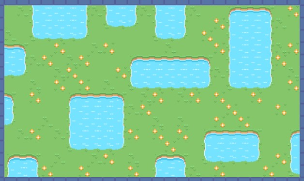
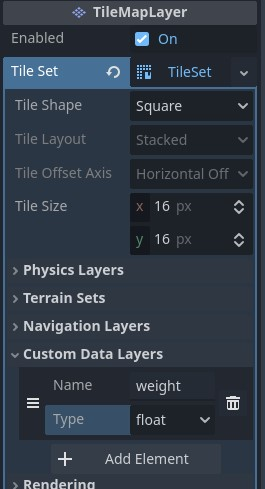
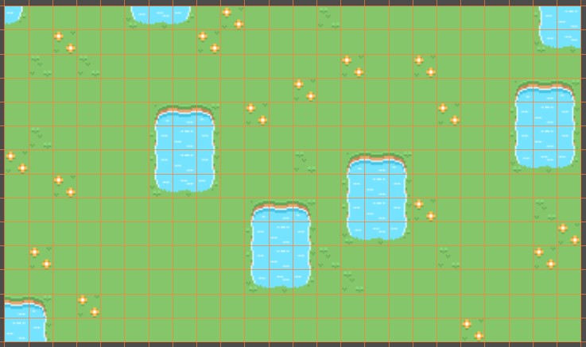

# Wave Function Collapse Lab 2

Welcome to lab 2. In this lab we will add a bit of code to enhance the wfc algorithm.

Open up the lab2 base scene to start. The prepared tile set is different from lab 1 and the default sample layer is also different. Other than that the code is identical to the wfc_demo scene for now.

If we generate the output now, it looks something like this:

This one sure has a lot of ponds and flowers. What if that is too many for the mood of the level we would like to achieve. Let's do something about this.random picking

## Adjusting the way tiles are randomly chosen

In lab 1 we had a way to prevent house tiles from spawning at all during random picking. They would only appear if a house tile was already present in the template. This might kinda work for the lakes but do we really want to draw seed tiles for the flowers? How about instead of making this choice binary we could do a weighted random pick.

There are two obvious ways to get the weights. If you want to use the custom data variant you just have to add the layer to the tile set again, it should look like this:

When the layer exists in the current implementation the weights will automatically be read and applied as described above. Be aware that the default value is 0.0 so no tiles would be chosen at all. You need to paint the values on in the tile set editor.

The second way is to count how often a tile occurs in the template. Look for the "build up dictionary of adjacencies" comment in the code, this would be the place where you can insert a count of the tiles. E.g. count the different values the variable cell_tile is set to. It's a texture atlas coordinate, a Vector2i, in case you are wondering.

Both options to model the weights have their own pros and cons. The custom data layer allows for precise number without having to deal with taking care about how often a tile occurs in the template. The counting method seems a more artisty natural approach which might work better when not just drawing all the possible combinations of tile adjacencies but a real level as a template. This would automagically preserve the relative frequency of occurance of tiles.

Ideally the weights should be normalized such that the highest value of the weights is 1.0. When counting this is an extra step at the end. When painting the waits to the tiles this needs to be taken care for manually or by also adding a normalization to the weights after reading them all.

Having the weights is just the first step. Now we get to make our hands dirty by pulling out the code in the random choice function and replace it with something more sophisticated. It's this one:

> func choose_tile(cell: Vector2i) -> Vector2i:

Before deleting the code in the function let's look at it again. We get a Vector2i cell coordinate which is in the output space. To know which tile candidates are still existing we can get them as an Array of Vector2i values from the super_positions dictionary. Without any weights we could just use the function "pick_random" on it. Now we need to apply a weighted choice.

A weighted choice can be implemented in various ways. Some are easier to implement, some are more mathematically correct, some are of deterministic time duration. We will look at two options, but you are free to - not so randomly - pick your own.

Rejection Sampling is one of the easiest ways of doing this. Basically we first use the pick_random function which gives each tile an equal chance. Then we draw another random float between 0 and 1 and comapre it to the weight of the chosen tile. If the weight is lower than the random number, the tile is rejected. So we need to pick a random tile again and compare the weight to a new random float. And so on. This is the downside of this simple implementation, if we are really unlucky just chosing one tile can take ages. It might be useful to limit the number of retries to at least have some deterministic worst case behaviour. Or ship your game with tea and chocolates to make up to the player for long waiting times.

Another way to go about a weighted random choice is to first build up an array of the incremental sum of weights of the tiles. So the first value in the array is the weight of the first possible tile, the second the some of the weights of the first and second and so on. Then we draw a random float between 0 and the total sum of weights and get the corresponding index to the array of weight sums. We could do this iteratively. Is the value in the array lower than the random value we got? Then try the next, until at the end of the array or the value in the array is higher than the random value. Anyway we use this index into the array of possible tiles et voilá weighted randomly chosen tile found.

Go ahead, implement this random pick and then let's compare results.

You may wonder why tiles with low weights come up more often then you thought. This may be due to how the rules work. For example a tile with a high weight might always enforce a tile with a high low weight because it's the only possible choice.

## Preserving Patterns

For this one you only get a brief introduction, so consider this advanced and no shame to skip. As you can see patterns of e.g. 2x2 tiles or 3x3 tiles don't really appear in the output as presented in the template. This is due to a limitation in the implementation. We only look at directly adjacent tiles so there is no record of larger tile patterns going together. It's time to look at the original wave function collapse algorithm:

[WaveFunctionCollapse Repository by Maxim Gumin](https://github.com/mxgmn/WaveFunctionCollapse?tab=readme-ov-file#algorithm)

So if you want to take a stab at overlapping wave function collapse you need to figure out how to handle NxN patterns instead of just individual tiles. And those patterns should be analyzed overlapped. It is doable buit not for the faint hearted.

## Final words

I hope you liked this lab. It was fun writing it. Do try the other labs if you feel up to it!

Written by: Thomas Lobig https://github.com/tlobig
