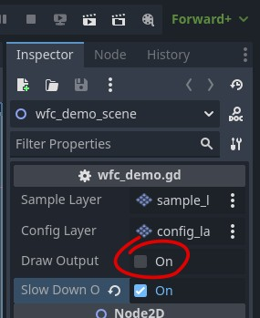
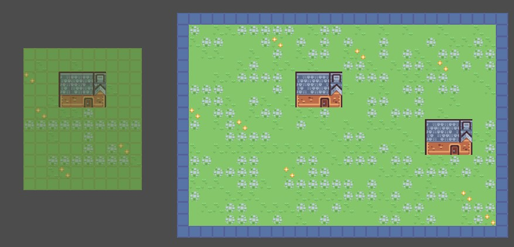

# Wave Function Collapse Demo

A demo of the wave function collapse algorithm in 2d. This demo was created for GodoCon 2024 as part of the Procedural Generation Workshop.

Code and accompanying labs written by Thomas Lobig. Includes textures from [Kenney](https://kenney.nl)

To start the generation of output open the project and the wfc_demo scene, select the root node and click on this "Draw Output" export variable:

you should get something like this:

To start one of the labs for this workshop project, take a look at the [lab overview document](doc/lab_overview.md)